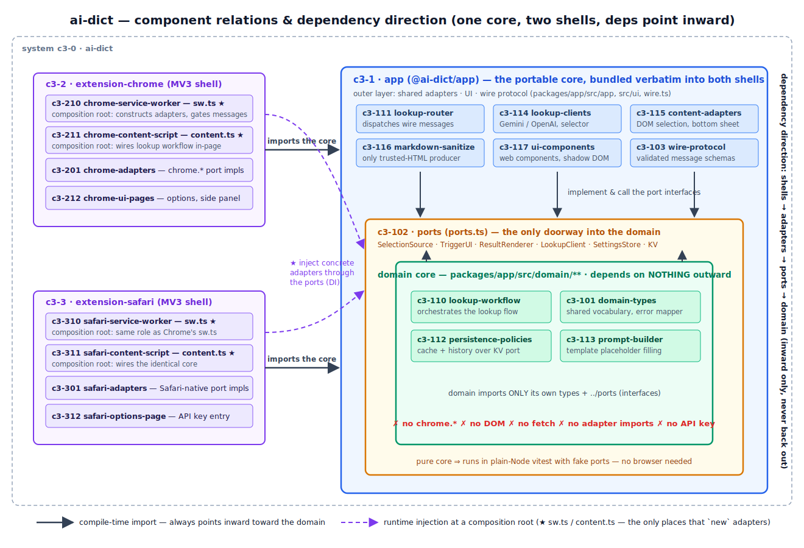

## Summary

Manifest V3 browser extension (Chrome + Safari/iOS) that looks up the word or phrase you select on a page using Google's Gemini API and shows the result in an in-page card / side panel.

## Architecture

**One portable core, two thin browser shells.** All lookup logic lives once in `@ai-dict/app` (`packages/app`) and is reused verbatim by the Chrome and Safari extensions, which add only platform glue.

*Diagram source: `docs/diagrams/architecture-dependencies.svg` — components per container, the ports ring around the domain core, and the inward-only dependency arrows (solid = compile-time import, dashed = runtime injection at the composition roots).*

The core follows a **lean dependency rule** — the testable heart of hexagonal ("ports & adapters") architecture, with the heavyweight packaging deliberately removed. An earlier design split the code across five packages (`core` / `adapters-shared` / `shared-ui` / …); that was judged overengineered for a two-surface extension and flattened to three packages (commit *"Flatten hexagon: 5 packages → 3, kill duplication"*). What survived the cut is the part that pays for itself:

1. **One-directional dependency.** Code points inward only. The domain never imports an adapter, the UI, or a platform API.
2. **Dependency-free core.** `packages/app/src/domain/**` imports only its own types and the port interfaces — no `zod`, no `chrome.*`, no `fetch`, no DOM. It runs unchanged in a content script, a service worker, or a plain-Node test.
3. **Communication through ports only.** The core states what it needs as interfaces in `packages/app/src/ports.ts` (`LookupClient`, `SettingsStore`, `Storage`, `SelectionSource`, `TriggerUI`, `ResultRenderer`). Concrete adapters implement them; the **composition roots** `sw.ts` and `content.ts` wire the real adapters in at startup.

See `ref-core-dependency-rule` for the rationale and `rule-domain-purity` for the enforced constraint. Background: `docs/knowledge-base/hexagonal-architecture.md`.

## Abstract Constraints

System-level non-negotiables every container inherits:

- **Portability before platform.** Lookup logic lives once in `@ai-dict/app`; `chrome.*` / Safari APIs appear only in `packages/extension-*`. New behavior goes in the core behind a port, not in a shell. (`ref-core-dependency-rule`)
- **The API key never leaves trusted ground.** The Gemini key lives only in the service worker and options page; it never crosses the `chrome.runtime` wire and never reaches a content script. (`rule-api-key-isolation`, spec S1)
- **Every cross-realm message is validated and origin-checked.** Content-script ↔ service-worker traffic is a single zod schema, and the SW rejects messages whose `sender.id` is not this extension. (`ref-wire-protocol-validation`, `rule-gate-runtime-messages`, spec S3)
- **Model output is sanitized before it touches the DOM.** Gemini markdown is rendered with raw HTML disabled, then DOMPurify-allowlisted. (`rule-sanitize-model-output`, spec S4)
- **bun-only toolchain.** `bun 1.3.14` builds, tests, and bundles everything; Node.js is not required. (`README.md`, `.bun-version`)

Full security model: `docs/superpowers/specs/2026-05-24-ai-dict-design.md` §7.3 (S1–S12).

## Containers

| ID | Container | Boundary | Role |
| --- | --- | --- | --- |
| c3-1 | app | workspace library (@ai-dict/app), no platform APIs | The portable core: domain, ports, wire protocol, shared adapters, UI web components. Bundled into both extensions. |
| c3-2 | extension-chrome | Chrome MV3 runtime, esbuild bundle, Playwright e2e | Chrome shell: service worker, content script, options + side panel, Chrome port adapters. |
| c3-3 | extension-safari | Safari/iOS (WebKit) MV3 runtime, esbuild bundle, Xcode wrapper | Safari/iOS shell: service worker, content script, options, Safari port adapters. |

**Data flow:** select text → content script shows a trigger → on click, content relays a `lookup` message to the service worker → SW checks cache, else calls Gemini → result flows back over the wire → content script renders an in-page card (Chrome also mirrors to a side panel).
