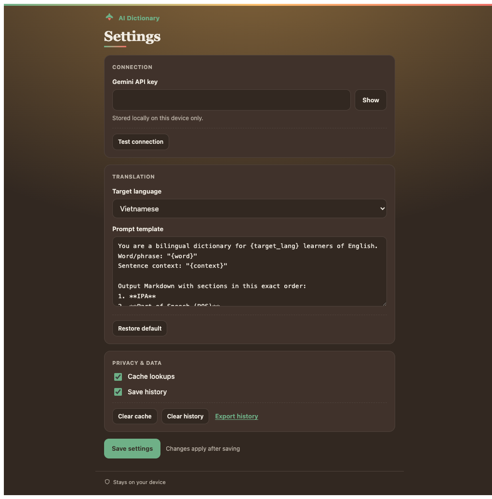
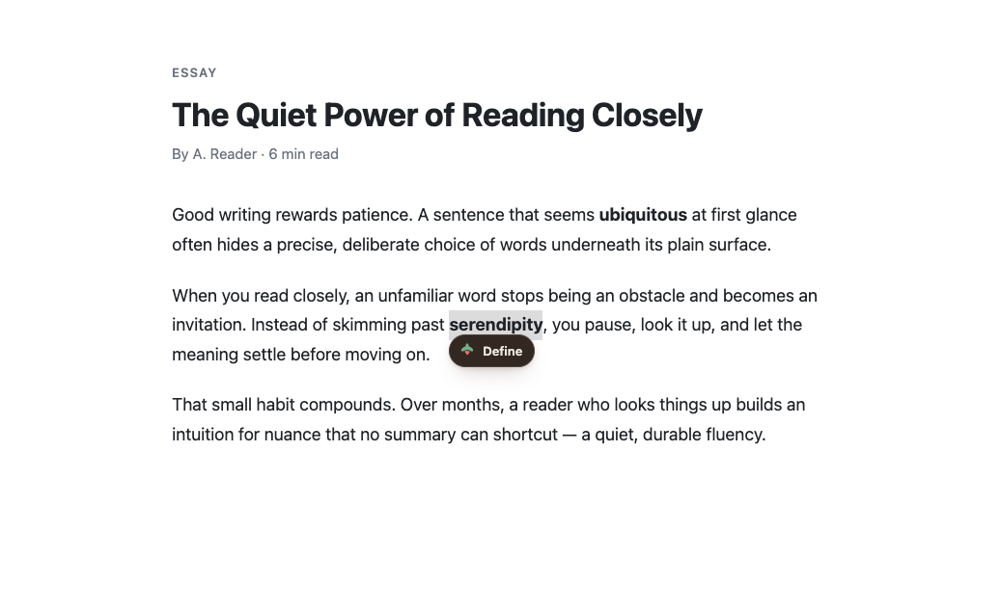
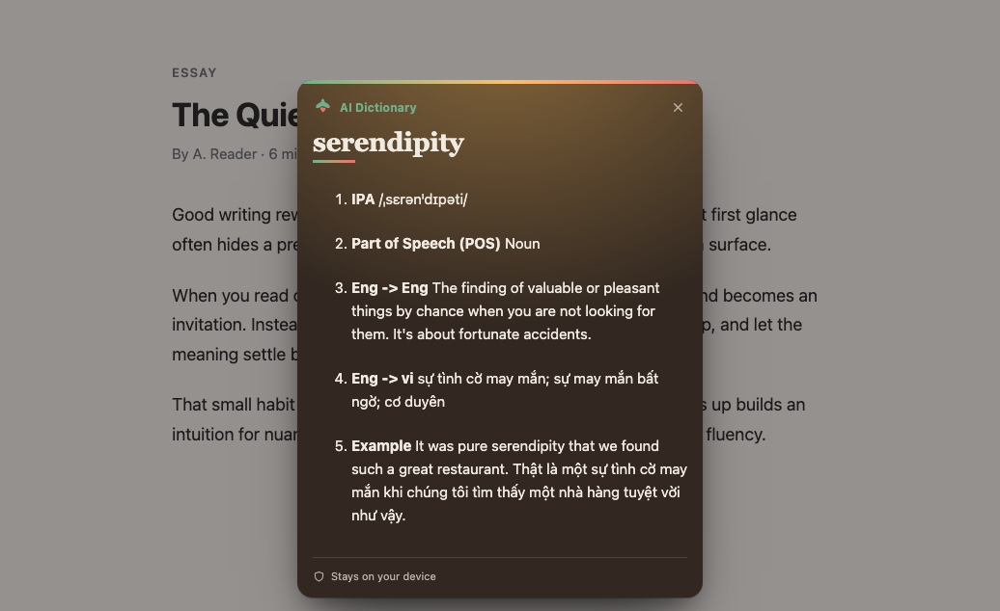

<h1 align="center">AI Dictionary</h1>

<p align="center">
  <strong>Look up any word — right where you're reading.</strong><br>
  Select a word on any web page and get its meaning <em>in that sentence</em>,
  in your own language, without leaving the page.
</p>

<p align="center">
  
  
  
  
</p>

## Ordinary dictionaries look up the _word_. This one reads the _sentence_.

Most dictionary apps and browser extensions — including Google's — take the word
you selected, **throw away everything around it**, and hand you back a list of
_every meaning that word has ever had_. You scroll and guess which one fits. Look
up _bank_ and it comes back as a riverside **and** a money business **and** a
slope — every time, no matter what you were actually reading.

**AI Dictionary keeps the sentence.** It reads the words around your selection,
works out which sense is actually in play, and gives you **only that one** —
already explained and translated into your language:

| You're reading…                               | A word-only dictionary gives you             | AI Dictionary gives you                          |
| --------------------------------------------- | -------------------------------------------- | ------------------------------------------------ |
| "I sit on the grassy **bank** of the river."  | _every_ sense: riverside · money · slope… 🤷 | 🌊 _the land along a river_ → **Bờ sông**        |
| "The next day the **bank** approved my loan." | _every_ sense: riverside · money · slope… 🤷 | 🏦 _a business that holds money_ → **Ngân hàng** |

Same word, opposite meanings — **picked from context, not guessed.** That's the
one thing a word-only dictionary can't do, and it's why AI Dictionary fits how
you actually read.

<p align="center">
  <a href="docs/demos/context-bank/context-bank-demo.mp4">
    
  </a>
</p>

<p align="center"><em>The same word in two sentences → two correct meanings, each chosen from its context. (<a href="docs/demos/context-bank/context-bank-demo.mp4">watch the video</a>)</em></p>

---

## Install (Chrome)

> [!NOTE]
> AI Dictionary works on **Google Chrome** on a computer (and Chrome-like
> browsers such as Edge or Brave). **Safari and iPhone/iPad are not supported
> yet** — a Safari version is planned, so please check back later.

There are two ways to install — pick one, then
[add your free Google key](#add-your-free-google-key).

### Option A — Chrome Web Store (recommended, for everyone)

One click, **automatic updates**, and no developer mode. This is the install for
day-to-day users.

> **Coming soon.** The Chrome Web Store listing is being set up — once it's live,
> the **Add to Chrome** button will appear here. Until then, use **Option B**
> below. _(Maintainers: the publish steps are in
> `docs/runbooks/chrome-web-store.md`.)_

### Option B — Load a build yourself (developers / early access)

The built extension is attached to every
[GitHub Release](https://github.com/hieplam/ai-dict/releases/latest) as
**`dist-chrome.zip`** — a developer artifact you can sideload before (or instead
of) the Web Store listing. It's the same build the store gets; it just doesn't
auto-update.

**[⬇️ Download AI Dictionary (dist-chrome.zip)](https://github.com/hieplam/ai-dict/releases/latest/download/dist-chrome.zip)**

Then unzip the downloaded file — **double-click** it on a Mac, or
**right-click → Extract All…** on Windows. You'll get a folder with the
extension's files in it. Put that folder somewhere it can stay (for example
your Documents folder): Chrome will read the extension from there from now on,
so don't delete it later.

<details>
<summary>Comfortable with the terminal? One command does the download for you.</summary>

This downloads the same files into `~/.ai-dict/dist`; re-run it any time to
update to the newest build:

```bash
curl -fsSL https://github.com/hieplam/ai-dict/raw/master/scripts/install-chrome.sh | bash
```

</details>

Then add it to Chrome — three clicks, no tools needed:

1. In Chrome's address bar, type `chrome://extensions` and press Enter.
2. Turn on the **Developer mode** switch in the top-right corner. (That's just
   Chrome's name for "let me add extensions from my own computer" — it doesn't
   change anything else about your browser.)
3. Click **Load unpacked** and choose the folder from above — the unzipped
   folder, or `~/.ai-dict/dist` if you used the terminal command.

AI Dictionary now shows up in your list of extensions.

### Add your free Google key

Whichever way you installed, the extension needs a **Gemini API key** — a
personal code from Google that lets it ask Google's AI for definitions. It's
**free**, and getting one takes about a minute — see
[Getting a Gemini API key](#getting-a-gemini-api-key) just below.

Open the extension's **settings** page (it opens by itself the first time),
paste your key, and click **Save**.

<p align="center">
  
</p>

> [!IMPORTANT]
> **Your key never leaves your browser.** There is no server and no account, so
> there is nothing to upload it to. The key is saved **only in your browser's
> local storage on this device** and is used for one thing: calling Google's
> Gemini API directly from your browser. See
> [Your API key & privacy](#your-api-key--privacy) for the full picture (and a
> way to avoid typing it into the UI at all).

That's it — you're ready to read.

---

## How to use

**1. Select a word or phrase** on any page while you read. A small **Define**
button pops up next to your selection.

<p align="center">
  
</p>

**2. Click _Define_.** The definition appears right on the page — pronunciation,
part of speech, an English explanation, a translation in your language, and an
example.

<p align="center">
  
</p>

**3. Keep reading.** Press <kbd>Esc</kbd> or click away to dismiss the card.
Prefer a sidebar? Click the toolbar icon to open the **side panel**, which keeps
the current definition and your recent lookups beside the page.

You can change the **target language**, tweak the **prompt template**, and toggle
**caching** and **history** any time from the extension's settings page.

---

## Customize the prompt template

Every definition is produced by sending Google's Gemini a short set of
instructions — _the **prompt**_. AI Dictionary ships with a sensible default,
but the **whole prompt is yours to rewrite**, so you can shape what every lookup
returns: add etymology, drop the IPA, ask for three example sentences, answer in
a different style, whatever suits how you read.

**Where:** open the extension's **settings** page → **Translation** section →
**Prompt template**. Edit the text, click **Save settings**, and your next lookup
uses it. Changed your mind? **Restore default** puts the shipped prompt back.

### Fill-in placeholders

Before the prompt is sent, AI Dictionary swaps each `{placeholder}` for the real
value from your current lookup. Use any of these — anything in `{curly braces}`
that isn't on this list is left untouched, so stray braces won't break anything:

| Placeholder     | Becomes…                                                    |
| --------------- | ----------------------------------------------------------- |
| `{word}`        | The word or phrase you selected.                            |
| `{context}`     | The sentence around it, so the answer fits how it's used.   |
| `{target_lang}` | Your target language (e.g. _Vietnamese_) from the dropdown. |
| `{source_lang}` | The language being defined — currently always _English_.    |
| `{url}`         | The address of the page you're reading.                     |
| `{title}`       | The title of that page.                                     |

### The default prompt

This is what ships out of the box — copy it as a starting point for your own:

```text
You are a bilingual dictionary for {target_lang} learners of English.
Word/phrase: "{word}"
Sentence context: "{context}"

Output Markdown with sections in this exact order:
1. **IPA**
2. **Part of Speech (POS)**
3. **Eng -> Eng** (learner-style definition in simple English)
4. **Eng -> {target_lang}** (translation)
5. **Example** (one short sentence in English + its {target_lang} translation)

Constraints:
- Disambiguate the sense based on the sentence context.
- Do not include any HTML.
- Do not repeat the user's input verbatim more than once.
- Keep the response under 200 words.
```

> [!TIP]
> Keep `{word}` and `{context}` in your prompt — they're what makes the answer
> fit _this_ sentence instead of a generic dictionary entry. The result is shown
> as Markdown, so asking for **bold** headings and short lists reads best on the
> card.

---

## Getting a Gemini API key

1. Go to **[Google AI Studio → API keys](https://aistudio.google.com/app/apikey)**.
2. Sign in with a Google account and click **Create API key**.
3. Copy the key and paste it into the extension's settings page.

You only pay Google for your own usage, and Gemini has a free tier that's plenty
for everyday reading. The default model is `gemini-2.5-flash`.

### Prefer ChatGPT?

Open the extension's settings, switch **AI provider** to **ChatGPT (OpenAI)**,
and paste an [OpenAI API key](https://platform.openai.com/api-keys). Lookups
then use OpenAI's `gpt-4o-mini` model with the same prompt template. Each
provider keeps its own key, so you can switch back and forth without re-entering
anything.

---

## Your API key & privacy

Worried your key will leak? It can't go anywhere it shouldn't — the extension is
built so your key (and your reading) stay yours:

- **No server, no account.** AI Dictionary has **no backend**. There is nothing
  to sign into and nowhere to upload your key to. Every lookup goes **straight
  from your browser to Google's Gemini API** and back — it is never proxied
  through, stored by, or shared with us or anyone else.
- **Saved only in your browser.** When you paste your key into the settings page,
  it's kept in your browser's local storage (`chrome.storage.local`) **on this
  device only** — never in the cloud. Remove it any time by clearing the field
  and clicking **Save settings**.
- **No tracking, no usage analytics.** Nothing about your browsing or lookups
  ever phones home. The _one_ exception is **opt-in, off-by-default** anonymous
  **error reports** — if you agree to a prompt (or flip the Settings toggle), the
  extension sends Google Analytics a bug signature (error type, a redacted
  message, the page's domain only, extension/browser version) to help fix
  crashes. No page content, no full URLs, no selected text, no API key — and you
  can turn it off any time. See [PRIVACY.md](PRIVACY.md).

**Two ways to provide the key — pick whichever you trust more:**

1. **Paste it into the settings page** — _the default; works with the standard
   Chrome install above._ The key lives only in this browser.
2. **Bake it into your own build with an environment variable** — _for people
   who build from source._ Set `GEMINI_API_KEY` before building and it's
   compiled into your personal build, so the key is **never typed into the UI or
   saved in browser storage at all** — it lives only in your own build, and the
   settings page stops asking for one. See [Local development](#local-development).
   Treat such a build as personal — anyone who can read its files can extract the
   key, so don't share it.

---

## FAQ & troubleshooting

<details>
<summary><strong>It says "Add your Gemini API key in Settings."</strong></summary>

You haven't saved a key yet, or it was rejected. Open the extension's settings
page, paste your key, and click **Save settings**. Use **Test connection** to
confirm the key works.

</details>

<details>
<summary><strong>The "Define" button doesn't appear.</strong></summary>

- Make sure you selected text on a normal web page. Browser pages like
  `chrome://…`, the New Tab page, and the Chrome Web Store are off-limits to all
  extensions.
- If you just installed or updated, **reload the tab** so the extension can run
on it.
</details>

<details>
<summary><strong>Is my reading private?</strong></summary>

Yes. There's no account and no server. Each lookup goes directly from your
browser to Google's Gemini API using your own key. The extension keeps no
analytics and phones nothing home; your key, cache, and history stay on your
device.

</details>

<details>
<summary><strong>Does it cost anything?</strong></summary>

The extension is free. You pay Google only for your own Gemini API usage, which
has a generous free tier.

</details>

<details>
<summary><strong>How do I update?</strong></summary>

Download the newest
[dist-chrome.zip](https://github.com/hieplam/ai-dict/releases/latest/download/dist-chrome.zip)
and unzip it into the same folder as before (or re-run the one-command
installer), then click **Reload** on the extension's card in
`chrome://extensions`.

</details>

---

## Local development

<details>
<summary>Build from source, run tests, and work on the extension.</summary>

### Prerequisites

- **[bun](https://bun.sh) `1.3.14`** — the only required toolchain (pinned in
  `.bun-version`). Install with `curl -fsSL https://bun.sh/install | bash`.
  Node.js is **not** required.
- A **Google Gemini API key** — entered in the options page at runtime, or baked
  into a personal build (see below). Not needed just to build.

### Setup

Install all workspace dependencies from the committed lockfile:

```bash
bun install
```

### Everyday commands

All commands run from the repo root.

| Command                | What it does                                            |
| ---------------------- | ------------------------------------------------------- |
| `bun run test`         | Run the full test suite once (vitest).                  |
| `bun run test:watch`   | Re-run tests on change (TDD loop).                      |
| `bun run typecheck`    | Type-check every package (`tsc --noEmit`).              |
| `bun run lint`         | Lint with ESLint.                                       |
| `bun run format`       | Auto-format with Prettier.                              |
| `bun run format:check` | Verify formatting (CI gate).                            |
| `bun run e2e:chrome`   | Run the Chrome extension end-to-end tests (Playwright). |
| `bun run build:chrome` | Build the Chrome extension.                             |

Run a script in a single package with `--filter`, e.g. only the app tests:

```bash
bun run --filter @ai-dict/app test
```

### Build and load the Chrome extension

```bash
bun run build:chrome
```

This bundles into `packages/extension-chrome/dist/` (service worker, content
scripts, options + side-panel pages, and the manifest). Then in Chrome:

1. Open `chrome://extensions` → enable **Developer mode**.
2. **Load unpacked** → select `packages/extension-chrome/dist`.
3. After editing code, re-run the build and click **Reload** on the extension card.

There's no bundler watch mode — re-run the build after changing extension code,
then reload the extension.

> **Personal build with a baked-in key:** if `GEMINI_API_KEY` is set in your shell
> when you build, the key is compiled into the bundle and the options page skips
> asking for it. Treat such builds as personal/dev artifacts — anyone who can read
> the extension can extract the key — and never distribute them.

### Architecture

It's a **bun workspace monorepo** — one portable core plus a thin Chrome shell:

| Package                     | Role                                                                                              |
| --------------------------- | ------------------------------------------------------------------------------------------------- |
| `packages/app`              | Platform-agnostic core: domain logic, ports, wire schema, UI web components, and shared adapters. |
| `packages/extension-chrome` | The Chrome MV3 shell (service worker, content scripts, options, side panel).                      |

The architecture is documented with **C3** in `.c3/` (a queryable model) — see
[`DESIGN.md`](DESIGN.md) for the engineering design. A Safari/iOS shell is a work
in progress and is **not yet supported**.

### Known tradeoffs

- **zod ships in the browser bundle.** Message validation uses
  [`zod`](https://zod.dev) directly in the service worker and content script
  instead of a hand-written shim, in exchange for a single, un-duplicated
  validation schema. It adds ~250 kB unminified. **Revisit if** service-worker
  cold-start latency or bundle size becomes a problem.

</details>

---

## More

- Product overview: [`PRODUCT.md`](PRODUCT.md)
- Engineering design: [`DESIGN.md`](DESIGN.md)
- Release steps: [`RELEASE_CHECKLIST.md`](RELEASE_CHECKLIST.md)
