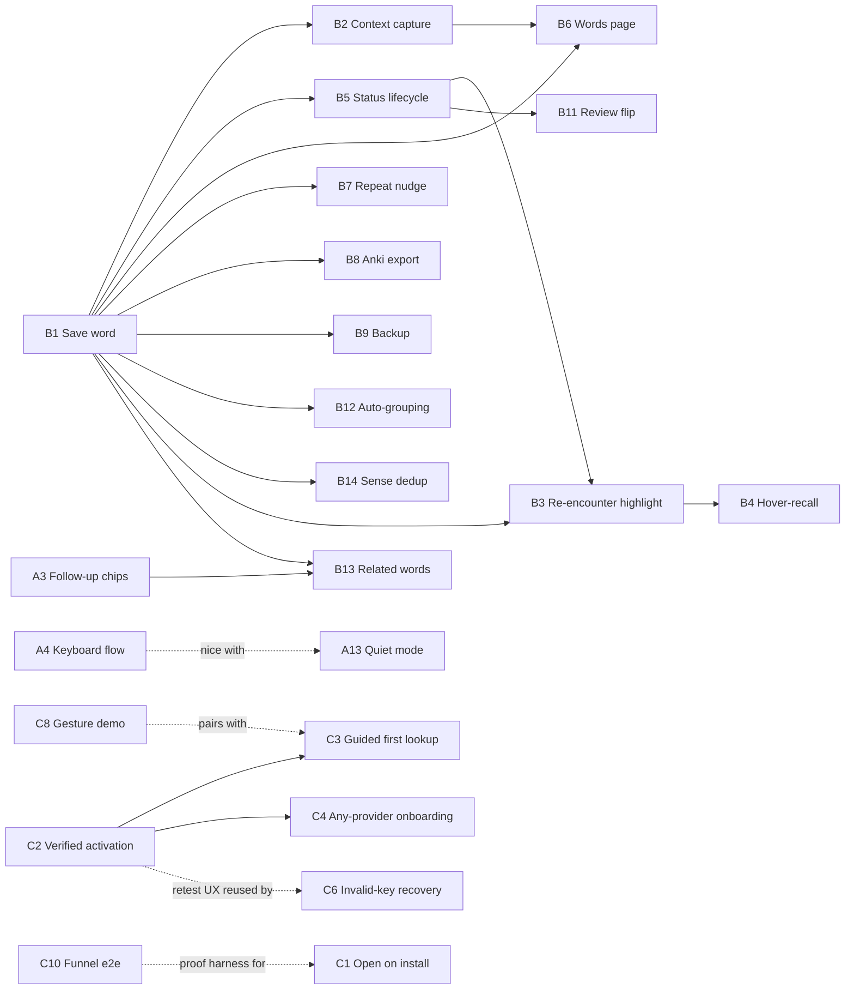

# AI Dictionary — Product Roadmap

> **What this is.** A ranked backlog of user-facing improvements, each written with
> enough context that a lead model can direct implementation and a smaller model can
> pick up any single idea without guessing. This document answers **What** and **Why**.
> It deliberately does **not** answer **How** — implementation design is the next phase.
>
> **Three themes:** (A) seamless reading UX that preserves the reader's context,
> (B) structuring the words a reader learns, and (C) first-run onboarding & activation —
> getting a new install to its first successful lookup. Target user is **70% reader / 30% learner**.

---

## 1. How to use this roadmap (decision authority)

This roadmap is built to be run by a **lead model acting as tribe leader**: it should
guide smaller implementer models and make most calls autonomously, escalating to the
human owner **only** for decisions that are hard to reverse or that change the product's
promise. Three roles:

| Role            | Who           | Responsibility                                                                    |
| --------------- | ------------- | --------------------------------------------------------------------------------- |
| **Owner**       | Human         | Sets direction; decides the escalations in §6.                                    |
| **Lead**        | Large model   | Sequences work, briefs implementers, reviews output, resolves ordinary ambiguity. |
| **Implementer** | Smaller model | Executes one idea at a time from its card + the standing constraints.             |

### What the lead decides autonomously

- Ordering within a category, and which idea to pick next (subject to the dependency map, §5).
- Any choice already pinned by an idea's **Scope fence** — those are settled; do not reopen.
- Implementation-shaped choices (component layout, token usage, test strategy) — these are
  the _How_ phase and belong to the implementer, reviewed by the lead.
- Enforcing the **Standing constraints** (§3). These are non-negotiable rules, not choices:
  a proposal that violates one is simply wrong and the lead rejects it without asking.

### What the lead MUST escalate to the owner (see the register in §6)

- **Irreversible data shapes** — the saved-word entry schema (B1/B2) and the backup file
  envelope (B9). Once real user data exists in a format, changing it needs a migration.
- **Product-promise changes** — anything that widens what the extension claims to do or
  changes its marketing story (A12 multi-language source; a real PDF commitment after A11).
- **New browser permissions** — any manifest permission beyond today's set (e.g. `file://`
  access for PDFs). Permissions affect the store listing and user trust.
- **Privacy-surface changes** — any feature that would read or store more of what the user
  reads than a lookup already does. Default answer is no; bring exceptions to the owner.
- **Cutting a scope fence** — if an idea can't meet its stated goal without breaking a fence,
  stop and escalate rather than quietly redefining the idea.

### Definition of done (per repo convention)

An idea is **done** only when its work is **PR merged into master via a regular merge commit
(squash-merge is prohibited — owner ruling 2026-07-16, §8)** with before/after evidence
attached, lint + format + tests green, and the C3 model updated if architecture changed.
"Code written" is not done.

### Scoring

**Impact** 1–5 (user value). **Effort** S/M/L. **Score = Impact ÷ Effort weight**
(S = 1, M = 2, L = 3). Score ranks _bang-for-buck_, not importance — a foundational
low-score idea can still be sequenced first because others depend on it.

---

## 2. Product context (read before any idea)

Today the flow is: select a word on a page → a small **Define** button pops up → click it →
the extension sends the word **plus its sentence** to the user's own AI key
(Gemini / OpenAI / Claude) → a card renders on the page with the single meaning that fits
that sentence, translated to the user's language. A **side panel** keeps the current lookup
plus a **Recent** history list. **Settings** control target language, the card's prompt
(**Card format**), theme, and cache/history toggles. Everything is **local**: no server, no
account, key stored only in the browser.

The product's one differentiator: it keeps the **sentence** and returns the **one sense in
play**, where ordinary dictionaries throw the sentence away and dump every meaning.

---

## 3. Standing constraints (every idea inherits these)

1. **100% local.** No backend, no accounts. File export/import allowed; nothing else leaves
   the browser except the AI API call itself.
2. **API-key isolation** (`rule-api-key-isolation`, S1). The key never appears in exports,
   logs, history, or any UI beyond the settings key field.
3. **Sanitize model output** (`rule-sanitize-model-output`, S4). Everything the LLM returns is
   sanitized before rendering — **including partial/streamed** output.
4. **No background LLM calls.** Tokens cost the user money; every model call is triggered by an
   explicit user action, and features that spend tokens say so first.
5. **Design tokens only.** UI reads `--ad-*` / `--adp-*` tokens; no hard-coded colors, no
   per-component `prefers-color-scheme` (theme is centralized via `data-ad-theme`).
6. **Ports architecture.** Core changes flow through `packages/app/src/ports.ts`
   (`ref-core-dependency-rule`); the domain stays dependency-free.

---

## 4. The ideas

Each card: **Today** (current behavior) → **Missing** (the gap) → **Why** (why it hurts) →
**Payoff** (what the user gets) → scope fence, dependencies, and decision authority.

### Category A — Seamless reading UX

_The user is reading. Every second, glance, and mouse trip a lookup costs is a tax on flow.
These ideas shrink the tax._

---

#### A4 — Keyboard-only flow `Impact 4 · Effort S · Score 4.0`

> **Status: ✅ Implemented (2026-07-10) — landed via squash-merge PR [#97](https://github.com/hieplam/ai-dict/pull/97) with before/after evidence (video).**
> Ships exactly 3 `chrome.commands` (`define-selection` / `dismiss-lookup` / `send-to-panel`),
> with no default keybindings — users assign keys themselves in
> `chrome://extensions/shortcuts`. No manifest permission change. Design/plan under
> `docs/superpowers/`.

- **Today:** After selecting a word you must move the mouse to the ~20px Define button and
  click it. Esc dismisses the card, but there is no keyboard way to _start_ a lookup.
- **Missing:** A shortcut meaning "define what I just selected."
- **Why:** Readers who select by double-click or keyboard lose their place hunting the button;
  each lookup becomes an aim-and-click chore.
- **Payoff:** Select → one key → read → Esc → keep reading. Hands stay on the keyboard.
- **Scope fence:** 3 commands only (define selection / dismiss / send to panel). No default
  binding — users assign keys in `chrome://extensions/shortcuts` to avoid site collisions.
- **Depends on:** — · **Lead decides:** command names, panel behavior. **Escalate:** none.

#### A8 — Phrase & idiom expansion `Impact 4 · Effort S · Score 4.0`

> **Status: ✅ Implemented (2026-07-10) — landed via squash-merge PR [#98](https://github.com/hieplam/ai-dict/pull/98) with before/after evidence (video).**
> A code-owned prompt instruction plus a machine-parseable `DEFINED_AS: "<term>" |
idiom|literal` signal line (stripped by `domain/defined-as.ts`) drives the card's idiom
> label and a "Show literal word" button that re-runs the lookup forcing the literal
> reading. No idiom-detection engine, no new manifest permission. Design/plan under
> `docs/superpowers/`.

- **Today:** Select just "bucket" in "kick the bucket" and the model _may_ mention the idiom or
  _may_ define the literal pail — it's luck, and nothing on the card says which happened.
- **Missing:** A guarantee: when the selection is part of an idiom/phrasal verb, define the
  whole unit — and label it.
- **Why:** Idioms are exactly where learners get lost; defining "up" for "give up" is a wrong
  answer wearing a right answer's face.
- **Payoff:** Card shows **defined as "kick the bucket" (idiom): to die**, with one tap to
  force the literal single word.
- **Scope fence:** Prompt instruction + card label + one button. **No idiom-detection engine** —
  the LLM already holds the sentence.
- **Depends on:** — · **Lead decides:** wording of the prompt instruction, label copy.
  **Escalate:** none.

#### A6 — Smart card placement `Impact 3 · Effort S · Score 3.0`

- **Today:** The card opens near the selection and can land **on top of the sentence** being read.
- **Missing:** A placement rule that treats the selected sentence as sacred ground.
- **Why:** The product's promise is "meaning _in this sentence_" — then the UI hides the sentence.
- **Payoff:** Definition and its sentence are always visible together. No re-finding your place.
- **Scope fence:** Positioning only; card stays an overlay and must never shift page layout.
- **Depends on:** — · **Lead decides:** placement heuristic. **Escalate:** none.

#### A16 — Sticky save bar on Settings `Impact 3 · Effort S · Score 3.0`

> **Status: ✅ Implemented (2026-07-05) — landing via squash-merge PR with before/after evidence.**
> The `.savebar` is now `position: sticky; bottom: 0` with a token surface + top border, and a
> dirty-state "Unsaved changes" cue that clears on save/hydration — in
> `packages/app/src/ui/settings-form.ts` (positioning + dirty-state only; Save's behavior and the
> field set are unchanged). Design/plan under `docs/superpowers/`.

- **Today:** The **Save settings** button sits in a normal `.savebar` div at the very bottom of
  a long settings form (provider, key, language, the Card-format textarea, appearance, history)
  — see `settings-form.ts:156`. It is not sticky.
- **Missing:** The primary action should stay reachable, and the form should signal that it has
  unsaved changes.
- **Why:** On the narrow side-panel/popup width (short, ~360px), changing a field near the top
  forces a scroll to the bottom to save. Two failure modes result: (1) friction on every change,
  and (2) **silent data loss** — the user edits a field, navigates away, and never realizes it
  was never saved.
- **Payoff:** Change anything and save it from where you are — no scroll hunt — with a clear
  "unsaved changes" cue so nothing is silently lost.
- **Proposed solution** (requested): pin the existing `.savebar` to the bottom of the settings
  viewport (`position: sticky; bottom: 0`) so Save + status stay visible while scrolling; give it
  a token-based surface + top border to separate it from content, and surface a dirty-state
  "Unsaved changes" cue that clears on save. Reuses today's markup — positioning + a dirty flag,
  no change to what Save does. _Alternative considered:_ a floating action button — rejected as
  less discoverable and it overlaps content; a sticky bar matches the existing footer pattern.
- **Scope fence:** Positioning + dirty-state only. No change to Save's behavior or the fields.
  Must use `--ad-*` tokens and honor reduced-motion.
- **Depends on:** — · **Lead decides:** sticky-bar over FAB (standard pattern), dirty-cue style.
  **Escalate:** only if the sticky bar visually conflicts with the shield footer
  (`settings-form.ts:163`) in a way that needs a broader settings redesign.

#### A9 — Instant cache hits `Impact 3 · Effort S · Score 3.0`

- **Today:** A cache toggle exists, but a repeat lookup still feels fresh — same wait pattern,
  and nothing tells you the answer came from cache.
- **Missing:** A hard repeat-speed guarantee (< 100 ms) + a visible "cached" badge; the cache key
  must include the **sense/context**, not just the word (so "bank" river vs. money don't collide).
- **Why:** Re-looking-up a word you met yesterday is the most common lookup there is; it should
  feel like memory, not a network call.
- **Payoff:** Second encounter = instant, zero tokens, and you can _see_ it was free.
- **Scope fence:** Delta on the existing cache — read `c3-112 persistence-policies` first; don't
  rebuild it.
- **Depends on:** — · **Lead decides:** badge copy, key composition. **Escalate:** none.

#### A10 — TTS pronunciation `Impact 3 · Effort S · Score 3.0`

- **Today:** The card shows IPA (e.g. /ˌsɛrənˈdɪpɪti/). Most readers can't read IPA, so they
  never learn how the word sounds.
- **Missing:** A speaker button that says the word aloud.
- **Why:** A word you can't pronounce is a word you won't use; IPA-only serves linguists, not readers.
- **Payoff:** One tap → hear the word. Free, instant, offline.
- **Scope fence:** Browser `speechSynthesis` only (0 API calls). Speaks the **word only** — never
  the whole definition. No cloud TTS.
- **Depends on:** — · **Lead decides:** voice/lang selection heuristic. **Escalate:** none.

#### A15 — Trigger latency budget `Impact 3 · Effort S · Score 3.0`

- **Today:** The Define button appears after selection, but there's no speed target and no test
  guarding it; on heavy pages it can lag behind the selection.
- **Missing:** A written budget (button visible < 50 ms after selection ends, zero forced reflow
  of the host page) plus an e2e assertion that fails CI on regression.
- **Why:** The trigger button is the product's front door; if it stutters, the whole extension
  feels broken before any AI is involved.
- **Payoff:** Selection → button feels native-instant on every page, permanently (the test locks it).
- **Scope fence:** Budget + test on the existing trigger; no behavior change.
- **Depends on:** — · **Lead decides:** exact budget numbers, test placement. **Escalate:** none.

#### A1 — Streamed answers `Impact 5 · Effort M · Score 2.5`

- **Today:** Click Define → the card waits until the **entire** answer is generated, then shows it
  all at once. On a slow model that's a multi-second blank stare.
- **Missing:** Progressive rendering — words appear as the model produces them.
- **Why:** Perceived speed is the biggest UX lever we have; today the reader's eyes are parked on a
  spinner during the exact moment they were mid-sentence.
- **Payoff:** First words visible in under 1 second; you read the meaning while the rest arrives —
  the wait effectively disappears.
- **Scope fence:** Every repaint of partial markdown must pass sanitization (S4, mandatory).
  Providers that can't stream fall back silently to today's behavior.
- **Depends on:** — · **Lead decides:** per-provider streaming vs. fallback. **Escalate:** none
  (S4 is a rule, not a choice).

#### A2 — Recursive lookup `Impact 4 · Effort M · Score 2.0`

- **Today:** The card is a dead end: if the _definition itself_ contains a word you don't know, you
  must close the card, and you can't select text inside it.
- **Missing:** Select any word inside the card/panel → define it, with Back navigation.
- **Why:** Definitions written for learners still contain hard words; "go find it elsewhere" is the
  exact problem this product exists to kill.
- **Payoff:** No dead ends — any unknown word, even inside an answer, is one selection away; Back
  walks up the chain.
- **Scope fence:** The sentence inside the definition is the inner lookup's context. Depth capped
  at 3.
- **Depends on:** — · **Lead decides:** stack UI, depth-cap UX. **Escalate:** none.

#### A3 — Follow-up chips `Impact 4 · Effort M · Score 2.0`

- **Today:** If an answer is too academic or you want an example, your only options are re-select
  and hope, or permanently rewrite the Card-format prompt in settings.
- **Missing:** One-tap refinements on the card: **Simpler · More examples · Etymology · Use it**.
- **Why:** The right depth differs per word, per person, per moment; a global prompt can't know that
  "epistemology" needs the simple version but "cat" doesn't.
- **Payoff:** Wrong answer? One tap fixes it — no typing, no settings, no re-selecting. Original
  word + sentence re-sent automatically.
- **Scope fence:** Fixed 4 chips in v1 (not configurable). Refined answer replaces the body; Back
  restores the original.
- **Depends on:** — · **Lead decides:** chip copy, result transition. **Escalate:** none.

#### A5 — Gloss mode `Impact 4 · Effort M · Score 2.0`

- **Today:** Every lookup opens the full card (pronunciation, POS, explanation, translation,
  example). For a quick "what's this word again?" that's a paragraph-sized interruption.
- **Missing:** An opt-in "Compact gloss" setting: Define shows a **one-line translation floating at
  the word**; click to expand into the full card.
- **Why:** A reader often needs 2 seconds of help, not 20; forcing the full card makes cheap
  questions expensive, so people stop asking them.
- **Payoff:** Skimming stays skimming — glance at the one-liner, keep moving; full card is one click away.
- **Scope fence:** A user setting for the render mode. **No auto-detection of "simple words"** — no
  difficulty classifier.
- **Depends on:** — · **Lead decides:** gloss anchor/positioning, setting copy. **Escalate:** none.

#### A13 — Per-site quiet mode `Impact 2 · Effort S · Score 2.0`

- **Today:** The Define button pops up on **every** text selection on **every** site — including
  code editors, Gmail, and dashboards where you select constantly and never want definitions.
- **Missing:** A per-site "don't show the button here" list.
- **Why:** Every unwanted popup teaches the user to resent the extension; the common fix is uninstalling.
- **Payoff:** Chosen sites go visually silent; the A4 shortcut still works there, so lookup stays
  possible — just never uninvited.
- **Scope fence:** Site list + toggle. **Depends on:** A4 (nice-to-have, for the still-works path).
  **Lead decides:** match granularity (domain vs. path). **Escalate:** none.

#### A14 — Double-click trigger `Impact 2 · Effort S · Score 2.0`

- **Today:** Lookup is always two gestures: select, then click the button.
- **Missing:** An opt-in mode where double-clicking a word defines it immediately.
- **Why:** For heavy users the button click is pure overhead; dictionary power-users expect
  double-click from tools like Eudic/GoldenDict.
- **Payoff:** One gesture per lookup.
- **Scope fence:** Off by default (many pages use double-click natively). Never fires in text
  fields or interactive elements. **Depends on:** — · **Lead decides:** guard list. **Escalate:** none.

#### A7 — Pin cards `Impact 3 · Effort M · Score 1.5`

- **Today:** One card at a time; it dies on click-away or scroll. Comparing a definition against a
  paragraph further down loses the definition.
- **Missing:** A pin button — the card detaches, floats, survives scrolling, can be dragged.
- **Why:** Real reading is non-linear; a term on page 1 pays off on page 3, but the extension's
  memory is shorter than the reader's.
- **Payoff:** Keep up to 3 definitions floating beside the text while you read on; Esc closes only
  the top one.
- **Scope fence:** Max 3 pinned; floating/draggable. **Depends on:** — · **Lead decides:** drag UX.
  **Escalate:** none.

#### A12 — Non-English source pages `Impact 3 · Effort M · Score 1.5`

- **Today:** The prompt's `{source_lang}` placeholder is **hard-coded to "English"**. Select a
  French or Japanese word and the model is told it's English — results are luck.
- **Missing:** Detect the selection/page language, fill `{source_lang}` truthfully, show the
  detected language on the card with a manual override.
- **Why:** People read in more than one foreign language; today the extension gives wrong-premise
  answers everywhere but English pages.
- **Payoff:** Works on any-language page — reading Le Monde, select a word, get its meaning in your
  language, same flow.
- **Scope fence:** Target-language logic unchanged; this fixes only the _source_ side.
- **Depends on:** — · **Escalate to owner:** this widens the product's promise from "English
  dictionary" to "any-language" — a marketing/positioning call, and it may affect the store listing.
  Lead prepares the option; owner decides whether to ship/advertise it.

#### A11 — PDF support (discovery spike first) `Impact 4 · Effort L · Score 1.3`

- **Today:** The extension does nothing inside Chrome's built-in PDF viewer — the #2 reading
  surface (papers, ebooks, reports).
- **Missing:** The same select→define flow in PDFs. **But** Chrome's PDF viewer does not run
  content scripts on PDF content, so the standard approach is a dead end.
- **Why (spike, not feature):** Committing to "PDF support" blind risks weeks of wasted work; the
  honest first step is a time-boxed feasibility study.
- **Payoff (of the spike):** A written go/no-go — which approach works (custom viewer? alternative
  selection APIs? "not worth it"), its cost, and any new permission it would need.
- **Scope fence:** Deliverable is a feasibility report, **not** a feature. **Depends on:** — ·
  **Escalate to owner:** the go/no-go after the spike, and any `file://`/host-permission the chosen
  path requires.

---

### Category B — Structuring learned words

_Today the extension has a goldfish memory — a flat Recent list. These ideas turn lookups into a
personal vocabulary, without turning reading into homework. Local-only throughout._

---

#### B1 — Save word (star) `Impact 5 · Effort S · Score 5.0` · **foundation**

> **Status: ✅ Implemented (2026-07-10) — landed via squash-merge PR [#99](https://github.com/hieplam/ai-dict/pull/99) with before/after evidence (video).**
> Ships the owner-ratified entry shape verbatim (see §8 Decision Log, E1) in an independent
> `saved:*` keyspace (`domain/saved-words-policy.ts`), fully isolated from `history:*`/
> `cache:*` — clearing history never touches saved words. `translation` ships as `''` for
> every B1-era save; B2 fills it in without touching the schema. Design/plan under
> `docs/superpowers/`.

- **Today:** Every lookup lands in one flat auto-history ("Recent") — the word you'll want forever
  sits next to 40 words you clicked once by accident. History can also be toggled off or purged,
  taking everything with it.
- **Missing:** A star on the card/panel — "this one matters to me" → saved to a **separate,
  permanent word list**.
- **Why:** History is what happened; a vocabulary is what you _chose_. Every learning feature below
  needs to know which words you care about, and auto-history can't tell it.
- **Payoff:** One tap while reading = word banked. No form, no folder choice, no interruption.
- **Scope fence:** New storage keyspace (`ref-kv-storage-prefixes`), independent of history —
  clearing history never touches saved words.
- **Depends on:** — · **Escalate to owner:** the **entry schema is defined in B2 and must be locked
  before B1 ships** (see B2 + §6) — it's the hardest thing to change later. This is the single most
  important escalation in the roadmap.

#### B2 — Rich context capture `Impact 4 · Effort S · Score 4.0`

> **Status: ✅ Implemented (2026-07-10) — landed via squash-merge PR [#100](https://github.com/hieplam/ai-dict/pull/100) with before/after evidence (screenshots).**
> Populates the `translation` field B1 left empty, via the same signal-line pattern A8
> established: a `{translation_instruction}` prompt slot asks the model for a
> `TRANSLATION: "..."` line, parsed by the new `domain/translation-line.ts`. The ratified
> entry schema (`SavedWordEntry`/`SavedWordSense`/`SavedWordStatus`) is untouched — verified
> field-for-field at every checkpoint audit and by the Shaman independently at ship time.
> Design/plan under `docs/superpowers/`.

- **Today:** A history entry is essentially the word and its definition; where you met it — the
  sentence, the page — is gone.
- **Missing:** Saving a word (B1) auto-stores: the word, the definition _as shown_, translation,
  **the original sentence, page URL, page title**, date, and status.
- **Why:** You remember "_serendipity_ from that essay about penicillin," not "serendipity, noun."
  The context IS the memory hook — and the extension already holds all of it at save time.
- **Payoff:** Every saved word answers "where did I meet you?" with a link back to the exact page —
  zero typing.
- **Scope fence:** Proposed v1 entry shape: `{ word, definition, translation, sentence, url, title,
savedAt, status, senses[] }`. **Depends on:** B1.
- **Escalate to owner:** **lock this schema before B1/B2 ship.** It is the contract every later
  idea (B3–B14, backup, export) reads and writes; changing it after users have data means a
  migration. Lead proposes the shape; owner ratifies.

#### B4 — Hover-recall `Impact 4 · Effort S · Score 4.0` · _needs B3_

- **Today:** Meeting a word you looked up last week means looking it up again — new API call, new
  wait, new tokens.
- **Missing:** When a saved word is highlighted (B3), hovering shows **your own saved meaning**
  instantly from local storage.
- **Why:** Asking the AI about a word you already own is paying twice; your saved entry is the
  better answer anyway.
- **Payoff:** Hover → your meaning in ~0 ms, 0 tokens, 0 network. Saved words start paying rent.
- **Scope fence:** Local-only popup; links to the full entry. **Depends on:** B3 (→ B1, B5).
  **Lead decides:** popup layout. **Escalate:** none.

#### B7 — Repeat-offender nudge `Impact 4 · Effort S · Score 4.0`

> **Status: ✅ Implemented (2026-07-10) — landed via squash-merge PR [#101](https://github.com/hieplam/ai-dict/pull/101) with before/after evidence (video).**
> On the 3rd lookup of a headword within 30 days, the card nudges "3rd time meeting this
> word — save it?" and reuses B1's exact save path (the identical `toggle-save` event the
> star button dispatches — no parallel save mechanism). A permanent `nudge:<word>` marker
> (`domain/nudge-policy.ts`, an independent keyspace from `saved:*`/`history:*`/`cache:*`)
> is set the instant the threshold first crosses, enforcing one nudge per word, ever, even
> with zero user interaction. Design/plan under `docs/superpowers/`.

- **Today:** You can look up "ubiquitous" five times in a month and the extension never notices —
  each lookup is a stranger.
- **Missing:** On the 3rd lookup of the same headword within 30 days, the card shows a one-line
  nudge: **"3rd time meeting this word — save it?"**
- **Why:** Repeat lookups are the most honest signal of "I keep failing to retain this"; the user
  shouldn't have to notice their own pattern.
- **Payoff:** Your leakiest words get captured with one tap, exactly when the leak is proven;
  dismiss = never nag for that word again.
- **Scope fence:** Uses existing history counts; one nudge per word, ever. **Depends on:** B1.
  **Lead decides:** threshold copy (3×/30d is the proposed default). **Escalate:** none.

#### B8 — Anki / CSV export `Impact 4 · Effort S · Score 4.0`

- **Today:** Words are locked inside the extension; an Anki user re-types cards by hand.
- **Missing:** Export saved words — with sentences and translations — as Anki-importable TSV, plus
  CSV and Markdown.
- **Why:** Serious spaced repetition is solved; Anki solved it. Feed that ecosystem, don't rebuild
  a worse one inside a dictionary.
- **Payoff:** Weeks of reading → a ready-made Anki deck in two clicks, each card carrying its real
  sentence.
- **Scope fence:** **No `.apkg`** (Anki imports TSV natively); column order documented; no scheduling
  engine, ever. **Depends on:** B1, B2. **Lead decides:** column order/format. **Escalate:** none.

#### B5 — Status lifecycle `Impact 3 · Effort S · Score 3.0`

> **Status: ✅ Implemented (2026-07-16) — landed via regular-merge PR [#105](https://github.com/hieplam/ai-dict/pull/105) (merge commit `c667cf8a`, no-squash policy).**
> Manual learning⇄known toggle on the existing save-row surface (in-page card + side panel via
> the shared `renderSaveRow`), backed by a new `savedWordSetStatus` domain write path and a
> `saved.setStatus` wire message. E1 schema untouched (0-line diff on `domain/types.ts`,
> verified at ship). First card delivered under the executor protocol: Shaman-authored
> spec/plan, Sonnet Warchief, 9 TDD tasks + dual-skinner audit (2 findings fixed, incl. a
> stale-async-reply race → shared unit-tested `createSaveReplyGuard()`), 687 unit tests +
> 9 e2e green. Design/plan under `docs/superpowers/`.

- **Today:** (With B1) a saved list only grows; mastered words sit forever beside ones you struggle
  with, and the list becomes noise.
- **Missing:** Two statuses — **learning** (default on save) → **known** (manual, from the hover
  popup or words page). Known words stop being highlighted (B3).
- **Why:** A vocabulary that can't retire words punishes progress: the better you get, the noisier
  it gets.
- **Payoff:** The list self-prunes; highlighting stays meaningful because it only marks words still
  in play.
- **Scope fence:** Exactly 2 states, manual only. **No auto-promotion in v1.** **Depends on:** B1.
  **Lead decides:** where the toggle lives. **Escalate:** none.

#### B9 — Backup & restore `Impact 3 · Effort S · Score 3.0`

- **Today:** All data lives in one browser's local storage; a new laptop, a Chrome reinstall, or a
  profile wipe erases the entire vocabulary. (100%-local is the promise — this is its price.)
- **Missing:** Export everything (saved words, history, settings) as one versioned JSON file;
  import on another machine (merge or replace — user picks).
- **Why:** We chose no-backend for privacy; backup files are how users get durability without
  breaking that promise.
- **Payoff:** Your vocabulary survives any machine; move devices in under a minute.
- **Scope fence:** Export **MUST NOT** contain the API key (S1). **Depends on:** B1.
- **Escalate to owner:** the **backup file envelope + version field** is a public, forward-compatible
  format — lock it before shipping (see §6), same reasoning as the entry schema.

#### B3 — Re-encounter highlighting `Impact 5 · Effort M · Score 2.5` · _needs B1, B5_

- **Today:** You save a word and the extension never mentions it again; when it reappears in
  tomorrow's article, nothing happens — the single most valuable learning moment passes unmarked.
- **Missing:** A subtle underline wherever one of your **learning**-status words appears on any page.
- **Why:** This is **spaced repetition disguised as reading** — the only review a reader will
  actually do, because the reading _is_ the review. "I know this word!" in the wild is the reward
  loop that makes saving worth it.
- **Payoff:** Saved words wink at you from real pages; recognition compounds passively, article
  after article.
- **Scope fence:** Hard perf budget — no measurable page-load impact (lazy scan). Matching = exact
  word-boundary + naive plural/-ed/-ing only, **no lemmatizer in v1**. Respects quiet-mode sites
  (A13); off switch in settings. **Depends on:** B1, B5.
- **Lead decides:** the v1 naive-matching rules and perf approach. **Escalate to owner:** any move
  _beyond_ naive matching (a lemmatizer/fuzzy match) — it raises false-positive highlights, a
  product-feel call.

#### B6 — Words page `Impact 4 · Effort M · Score 2.0` · _needs B1, B2_

- **Today:** The side panel shows a linear Recent list — fine for 10 entries, useless for 300. No
  search, no filters.
- **Missing:** A collection view **inside the side panel**: search, filter by status/site, sort by
  date or lookup-count, edit status, delete.
- **Why:** Once saving works, the collection is an asset — and an asset you can't search is a junk drawer.
- **Payoff:** Any saved word findable in under 5 seconds.
- **Scope fence:** Lives in the side panel, not a new options tab. **Depends on:** B1, B2. **Lead
  decides:** filter/sort UI. **Escalate:** none.

#### B13 — Related words on save `Impact 2 · Effort S · Score 2.0` · _needs A3, B1_

- **Today:** Each saved word is an island — "spectate" isn't connected to spectator, spectacle, inspect.
- **Missing:** A "Related words" chip (part of A3's row) whose result — synonyms, antonyms, family —
  is **persisted onto the saved entry**.
- **Why:** Words are learned in families; roots are English's compression algorithm. One good answer
  turns 1 saved word into 4.
- **Payoff:** Your lexicon grows connections, not just entries; the family is there later with no new
  API call.
- **Scope fence:** Persisted onto the entry (extends the B2 schema). **Depends on:** A3, B1. **Lead
  decides:** chip copy. **Escalate:** none (but the schema field goes through the B2 lock).

#### B15 — Site lookup stats `Impact 2 · Effort S · Score 2.0`

- **Today:** The extension has no notion of _where_ lookups happen; you can't see The Economist
  drives 10× the lookups of Reddit.
- **Missing:** A per-domain tally — lookups and saves per site — from existing history.
- **Why:** Knowing which sources stretch you (and which bore you) helps pick tomorrow's reading at
  the right level.
- **Payoff:** A glanceable "where do I actually learn?"
- **Scope fence:** **Counts from existing lookup history ONLY** — never track pages read or page
  content (that would be surveillance). **Depends on:** — · **Lead decides:** presentation. Constraint
  is a rule, not a choice.

#### B10 — Weekly digest `Impact 3 · Effort M · Score 1.5`

- **Today:** No sense of progress exists; words scroll by and nothing sums a week.
- **Missing:** A small side-panel section, computed when you open the panel: words met this week,
  repeat lookups, top source sites.
- **Why:** Gentle awareness sustains a habit better than gamification — and a reader-first user would
  hate streaks and badges.
- **Payoff:** Open the panel Friday → "23 lookups, 6 saved, 3 repeat offenders, mostly from nautil.us."
- **Scope fence:** Computed on open — no background jobs, no notifications, no streaks. **Depends on:**
  — · **Lead decides:** which stats. **Escalate:** none.

#### B11 — Casual review flip `Impact 3 · Effort M · Score 1.5` · _needs B1, B5_

- **Today:** No way to revisit saved words except reading the list — no active recall.
- **Missing:** An optional "5-minute flip" in the side panel: shows the **original sentence** of a
  recent learning-status word → tap to reveal your saved meaning → optionally mark known.
- **Why:** Some moments invite light review, but a scheduler with due dates turns a reading tool into
  homework the reader will abandon.
- **Payoff:** Guilt-free review — deck = learning words from the last 14 days, shuffled; do 5 or 50,
  nothing is "overdue."
- **Scope fence:** **No scheduling algorithm, no due dates, no streaks — permanently out of scope**
  (stated so no future contributor "improves" it into Anki). **Depends on:** B1, B5. **Lead decides:**
  deck window, card UI. **Escalate:** none.

#### B12 — LLM auto-grouping `Impact 3 · Effort M · Score 1.5` · _needs B1_

- **Today:** (With B1) saved words pile up as one undifferentiated list; manual folders would work,
  but nobody files 200 words by hand.
- **Missing:** One button — "Organize my words" → the LLM clusters saved words into editable topic
  tags ("finance", "words from Latin _spec-_").
- **Why:** Structure helps recall, but structure-by-hand never happens; this is the one place AI should
  do the librarian work.
- **Payoff:** 200 loose words → a dozen meaningful groups in one tap; tags are yours to edit.
- **Scope fence:** Runs **only on explicit button press**, never in background; warns it spends the
  user's tokens (S4/constraint 4). **Depends on:** B1. **Lead decides:** prompt, tag-edit UI.
  **Escalate:** none.

#### B14 — Sense-aware dedup `Impact 3 · Effort M · Score 1.5` · _needs B1_

- **Today:** (With B1) saving "bank" from a river article and later from a finance article makes two
  disconnected entries of the same headword.
- **Missing:** On saving an already-saved headword with a new sentence, offer "add as a new sense?" —
  one entry, multiple senses, each with its own sentence and source.
- **Why:** A pile of duplicates reads like a log; one headword with its senses reads like a dictionary —
  _your_ dictionary.
- **Payoff:** "bank — 1. riverside (hiking blog) · 2. money business (FT)." Polysemy becomes visible
  structure you collected.
- **Scope fence:** Case-insensitive exact headword match only; "run"/"running" stay separate in v1.
  Uses the `senses[]` field from B2's schema. **Depends on:** B1. **Lead decides:** merge-prompt UX.
  **Escalate:** none (schema field via the B2 lock).

---

### Category C — First-run onboarding & activation

_A funnel audit (2026-07-16, live extension driven through the Playwright harness) found the
install → key → first-lookup funnel leaks at every step: nothing opens onboarding on install,
activation claims success without ever testing the key, and a bad key fails minutes later as a
red error mid-reading. These ideas close the seven audited dead-ends._

**Measured goal for the whole category:** audited funnel dead-ends go **7 → 0**, each closure
proven by a fresh-profile e2e run that walks install → onboarding → verified key → first
successful lookup (C10 is that proof harness). Real-user funnel telemetry is deliberately **not**
proposed — it would widen the privacy surface (standing constraint 1 + §1 escalation rules); the
e2e-simulated funnel is the measurement.

**Standing walls all C-ideas inherit (verbatim from §3):** no backend/accounts · every LLM call
user-triggered · no new manifest permissions · privacy surface unchanged · S1 key isolation.
**No new §6 escalations:** every C-idea fits existing permissions and the existing product promise.

**Sequencing the lead should follow:** C10 first (it is the proof harness the others' DoD cites),
then C1 → C2 → C5 → C6 → C7 → C8 → C3 → C4 → C9.

---

#### C1 — Open onboarding on install `Impact 5 · Effort S · Score 5.0` · **foundation**

- **Today:** Installing the extension does nothing — `sw.ts` has no `chrome.runtime.onInstalled`
  listener. The welcome screen (`onboarding-view`, options page) is only ever reached if the user
  happens to select text, spot the ~20px Define button, click it, get the no-key card, and click
  "Open Settings" — or finds the side panel via the toolbar icon.
- **Missing:** On `onInstalled` with `reason === 'install'`, open `options.html` once so the very
  first thing a new user sees is the welcome screen.
- **Why:** The drop happens before the product's first screen is ever seen; an onboarding page that
  nobody reaches cannot onboard anybody.
- **Payoff:** 100% of new installs see Welcome → key setup, instead of the lucky few.
- **Scope fence:** Fires **only** on `reason === 'install'` (never on `'update'`); opens exactly one
  tab, once — no re-prompting loop; skipped entirely when the build bakes an env key. No new
  permission (`runtime.onInstalled` needs none).
- **Depends on:** — · **Lead decides:** nothing else; this is deliberately minimal. **Escalate:** none.

#### C2 — Verified activation `Impact 5 · Effort S · Score 5.0` · **foundation**

- **Today:** "Save & activate" accepts any non-empty string — `onboarding-view.submit()` checks only
  `length > 0`, `options.ts` persists it and immediately shows **"You're all set."** The wire
  message `connection.test` and its router path already exist but are reachable only from the
  settings form. A wrong/expired key therefore fails **later**, as a red "Lookup failed" card in
  the middle of reading.
- **Missing:** Activation runs one real, user-triggered `connection.test` round-trip with the pasted
  key and only claims success when the provider answers; failures render inline with actionable
  copy (typo? expired? quota?).
- **Why:** A false "all set" converts a setup error into product distrust — the user believes the
  extension is broken, not the key.
- **Payoff:** Bad keys are caught at paste time, in the one place the user is already looking.
- **Scope fence:** Exactly one test call per explicit "Save & activate" click (constraint 4 holds:
  user-triggered, and the cost is ~one token). Timeout + offline get their own copy. Reuses the
  existing `connection.test` path — no new wire message unless the key-under-test can't ride it.
- **Depends on:** — · **Lead decides:** persist-on-pass vs. persist-with-warning semantics (recommend
  persist only on pass, with a "save anyway" escape hatch for offline setups). **Escalate:** none.

#### C8 — Gesture demo on the welcome screen `Impact 4 · Effort S · Score 4.0`

- **Today:** The welcome lead paragraph _tells_ ("Look up any English word right where you're
  reading") but never _shows_ the select → Define gesture; after activation the settings status
  line again tells ("Highlight any word…") with nothing to practice on.
- **Missing:** A small inline demo on the onboarding surface itself — a real sentence with a word
  that visibly gets selected and sprouts the Define pill (CSS/inline-SVG animation, token-themed),
  so the gesture is understood before the user ever leaves setup.
- **Why:** The product's trigger is an invisible gesture; users who never learn it churn with a
  correctly configured key.
- **Payoff:** Every user leaves onboarding knowing exactly what motion produces a definition.
- **Scope fence:** Pure UI demo — **0 API calls**, no video assets, `--ad-*`/`--adp-*` tokens only,
  honors reduced-motion. Works before a key exists.
- **Depends on:** — (pairs naturally with C3) · **Lead decides:** demo copy/animation. **Escalate:** none.

#### C5 — Key paste hygiene & format hints `Impact 3 · Effort S · Score 3.0`

- **Today:** The key input saves verbatim. A trailing newline from a copy, smart quotes from a chat
  app, or an OpenAI `sk-…` key pasted into the Gemini-only field are all accepted silently and fail
  later as INVALID_KEY. The placeholder "AIza…" is the only format guidance.
- **Missing:** Trim whitespace/quotes on paste; recognize known prefixes (`AIza` Gemini · `sk-ant-`
  Anthropic · `sk-` OpenAI) and hint when the key looks like a different provider's; flag obviously
  malformed input inline before activation.
- **Why:** Key-paste errors are invisible typos — the user did everything right and still fails,
  with no clue why.
- **Payoff:** The most common activation failure class disappears before the test call even runs.
- **Scope fence:** Heuristic **hints**, never hard blocks (providers change formats); the key never
  appears in any log or message (S1); pure client-side string checks.
- **Depends on:** — · **Lead decides:** hint copy, prefix table. **Escalate:** none.

#### C6 — Invalid-key recovery flow `Impact 3 · Effort S · Score 3.0`

- **Today:** A rejected key renders "Lookup failed / Google rejected the API key." with an "Open
  Settings" button that lands on the generic settings form — key field unfocused, no explanation of
  causes, no retest; the user re-enters a key blind and must find "Test connection" themselves.
- **Missing:** The INVALID_KEY card deep-links to the options page in a fix-key mode (key row
  focused, likely causes listed, connection test auto-run after the edit) — the same landing the
  no-key card already gets via onboarding.
- **Why:** The one moment a user is told their key is bad is the worst-guided moment in the product.
- **Payoff:** "Bad key" becomes a 20-second fix loop: focused field → paste → auto-retest → back to
  reading.
- **Scope fence:** Copy + deep-link/focus + reuse of the existing `connection.test`; no new error
  taxonomy, no provider-specific diagnosis beyond the existing error mapper.
- **Depends on:** — (C2 builds the retest UX it reuses) · **Lead decides:** deep-link mechanism
  (hash param vs. stored flag). **Escalate:** none.

#### C7 — Finish-setup toolbar badge `Impact 3 · Effort S · Score 3.0`

- **Today:** A keyless install looks identical to a configured one in the toolbar; if the user
  closes the welcome tab (or never sees it), no surface anywhere says setup is unfinished.
- **Missing:** While no usable key exists, the action icon carries a small badge (e.g. `!`) and a
  "Finish AI Dictionary setup" tooltip; both clear the moment activation succeeds.
- **Why:** An interrupted setup needs a persistent, quiet way back in; today the extension simply
  goes silent forever.
- **Payoff:** Every abandoned setup keeps exactly one visible, non-nagging thread back to Welcome.
- **Scope fence:** Badge is **only** a no-key indicator in v1 — not a general notification channel;
  env-key builds never show it; `chrome.action.setBadgeText` needs no new permission.
- **Depends on:** — · **Lead decides:** badge glyph/color (tokens). **Escalate:** none.

#### C10 — Deterministic funnel e2e `Impact 3 · Effort S · Score 3.0` · **proof harness**

- **Today:** `esbuild.config.mjs` bakes `GEMINI_API_KEY` from the builder's shell into the bundle;
  with a key exported in `~/.zshrc`, every local build silently disables onboarding
  (`options.ts` `KEY_FROM_ENV` routing) and **all three onboarding e2e specs fail** — hit live
  during the 2026-07-16 audit. No e2e walks install → first lookup as one journey.
- **Missing:** The e2e build explicitly clears the env key so onboarding e2e is deterministic on
  every machine; plus one funnel spec that walks fresh profile → welcome → (mocked) verified key →
  first successful lookup and becomes the category's definition-of-done gate.
- **Why:** A funnel the team cannot reproduce cannot be protected; today the suite's outcome depends
  on whose shell built `dist/`.
- **Payoff:** "Works on my machine" flake gone; every C-idea lands with a funnel test that keeps it
  closed.
- **Scope fence:** Dev-infra only — no product behavior change; the env-key build feature itself
  stays exactly as is.
- **Depends on:** — (sequenced first as the category's proof harness) · **Lead decides:** build-flag
  mechanics. **Escalate:** none.

#### C3 — Guided first lookup `Impact 5 · Effort M · Score 2.5` · _needs C2_

- **Today:** After activation the settings status says "Highlight any word while reading and choose
  Define" — the user is sent away to complete the funnel alone, and the aha moment happens
  off-screen or never.
- **Missing:** Right after verified activation, a "Try it now" sentence appears on the same page;
  the user selects a word there and runs a **real** lookup (their key, one explicitly-labelled
  call), seeing the real card render in place. Funnel completes inside onboarding.
- **Why:** The distance between "key saved" and "first definition seen" is where the remaining
  drop lives; closing it on-page makes activation end in the product's actual value.
- **Payoff:** Every activated user sees their first definition within seconds, guaranteed.
- **Scope fence:** User-triggered only, with visible "uses your key" microcopy (constraint 4);
  reuses the real lookup pipeline and card rendering (S4 sanitization included) — no separate demo
  renderer; skipped silently if the page can't host it.
- **Depends on:** C2 (only a verified key makes try-it reliable) · **Lead decides:** hosting
  mechanism (options page sends `lookup.request` like the panel vs. bundled demo page).
  **Escalate:** none.

#### C4 — Any-provider onboarding `Impact 4 · Effort M · Score 2.0`

- **Today:** The manifest and settings already support Gemini, OpenAI, **and** Anthropic — but the
  welcome screen is hard-wired Gemini (`OnboardingValue = { apiKey, targetLang }`, Gemini copy, AI
  Studio link). An OpenAI/Claude user must abandon onboarding, discover full settings, and
  configure there.
- **Missing:** A provider choice on the welcome screen (Gemini default) with the right get-key link,
  placeholder, and prefix hint per provider; activation stores the chosen provider's key.
- **Why:** Users who already pay for one provider are the _most_ motivated cohort, and onboarding
  currently tells them the product is for someone else.
- **Payoff:** All three provider audiences activate on the first screen, no detour.
- **Scope fence:** One key activates (multi-key stays in settings); Gemini remains the default and
  the "free" path; store listing already names all three providers — **no product-promise change**.
- **Depends on:** C2 (verification must test the chosen provider) · **Lead decides:** picker UI.
  **Escalate:** none.

#### C9 — Setup health check `Impact 3 · Effort M · Score 1.5`

- **Today:** When setup breaks later (key revoked, provider outage, shortcut unassigned), the pieces
  are scattered: `connection.test` hides in settings, shortcut assignment lives in
  `chrome://extensions/shortcuts`, configured-provider state is invisible.
- **Missing:** A "Check my setup" section in settings: key present per provider, active provider
  responds (explicit click, token-cost disclosed), keyboard shortcuts assigned
  (`chrome.commands.getAll`), each row with its one-click fix or deep link.
- **Why:** Post-onboarding breakage currently re-runs the whole bad-first-day experience.
- **Payoff:** Any broken setup diagnoses itself in one screen, one click.
- **Scope fence:** All checks read-only except the explicit connection test; runs only on click —
  nothing in the background; no new permissions (`commands` API is already granted by the
  `commands` manifest key).
- **Depends on:** — · **Lead decides:** check list v1. **Escalate:** none.

---

## 5. Dependency map



**Reading order that respects dependencies:** B1 → B2 (lock schema) → B5 → B3 → B4 unlocks the whole
learning spine. Everything in Category A except A13→A4 and B13→A3 is independent and safe to pick in
any order. In Category C, C10 goes first (it is the proof harness every other C-card's DoD cites),
C3/C4 wait for C2; the rest are independent.

---

## 6. Escalation register (the only things that need the owner)

The lead runs everything else. Bring these — and only these — to the human:

| #   | Decision                                          | Why it's the owner's call                                                | Blocks                        |
| --- | ------------------------------------------------- | ------------------------------------------------------------------------ | ----------------------------- |
| E1  | **Saved-word entry schema** (B2 shape)            | Irreversible once users have data; every B-idea reads/writes it.         | B1, B2, and all of Category B |
| E2  | **Backup file envelope + version** (B9)           | A public, forward-compatible format; changing it strands exported files. | B9                            |
| E3  | **Multi-language source** (A12) go/ship/advertise | Widens the product promise beyond "English"; affects store positioning.  | A12                           |
| E4  | **PDF go/no-go + permissions** (A11)              | Needs the spike result, and likely a new `file://`/host permission.      | A11                           |
| E5  | **Matching beyond naive** (B3)                    | A lemmatizer raises false-positive highlights — a product-feel tradeoff. | B3 v2                         |
| E6  | **Any new manifest permission** (general)         | Permissions change the store listing and user-trust story.               | any idea that needs one       |

Everything not in this table, the lead decides and directs. **E1, E2, E3, and E4 are
resolved — see §8 Decision Log** (E4's spike is approved; the post-spike go/no-go and any
new permission remain owner calls, as does E5 and E6).

---

## 7. Ranked summary (flat, by score)

| Rank | Idea                                | Score | Rank | Idea                       | Score |
| ---- | ----------------------------------- | ----- | ---- | -------------------------- | ----- |
| 1    | B1 Save word ·foundation ✅ Shipped | 5.0   | 12   | C5 Key paste hygiene       | 3.0   |
| 1    | C1 Open on install ·foundation      | 5.0   | 12   | C6 Invalid-key recovery    | 3.0   |
| 1    | C2 Verified activation ·foundation  | 5.0   | 12   | C7 Finish-setup badge      | 3.0   |
| 4    | A4 Keyboard flow ✅ Shipped         | 4.0   | 12   | C10 Funnel e2e ·harness    | 3.0   |
| 4    | A8 Idiom expansion ✅ Shipped       | 4.0   | 19   | A1 Streamed answers        | 2.5   |
| 4    | B2 Context capture ✅ Shipped       | 4.0   | 19   | B3 Re-encounter highlight  | 2.5   |
| 4    | B4 Hover-recall                     | 4.0   | 19   | C3 Guided first lookup     | 2.5   |
| 4    | B7 Repeat nudge ✅ Shipped          | 4.0   | 22   | A2 Recursive lookup        | 2.0   |
| 4    | B8 Anki export                      | 4.0   | 22   | A3 Follow-up chips         | 2.0   |
| 4    | C8 Gesture demo                     | 4.0   | 22   | A5 Gloss mode              | 2.0   |
| 11   | A6 Smart placement                  | 3.0   | 22   | A13 Quiet mode             | 2.0   |
| 11   | A16 Sticky save bar ✅ Shipped      | 3.0   | 22   | A14 Double-click           | 2.0   |
| 12   | A9 Instant cache                    | 3.0   | 22   | B13 Related words          | 2.0   |
| 12   | A10 TTS                             | 3.0   | 22   | B15 Site stats             | 2.0   |
| 12   | A15 Latency budget                  | 3.0   | 22   | C4 Any-provider onboarding | 2.0   |
| 12   | B5 Status lifecycle ✅ Shipped      | 3.0   | 30   | A7 Pin cards               | 1.5   |
| 12   | B9 Backup/restore                   | 3.0   | 30   | A12 Non-English source     | 1.5   |
| —    |                                     |       | 30   | B10 Weekly digest          | 1.5   |
| —    |                                     |       | 30   | B11 Review flip            | 1.5   |
| —    |                                     |       | 30   | B12 Auto-grouping          | 1.5   |
| —    |                                     |       | 30   | B14 Sense dedup            | 1.5   |
| —    |                                     |       | 30   | C9 Setup health check      | 1.5   |
| —    |                                     |       | 37   | A11 PDF (spike)            | 1.3   |

**Score ≠ sequence.** B1 leads despite being foundational-first, not because of raw score; the lead
sequences by dependency (B1→B2→B5→B3) and by quick-win clustering (the S-effort A-ideas), escalating
only the six items in §6.

---

## 8. Decision Log

_(append-only; date · card · question · ruling · decided by)_

**Campaign: "Top 5 value" batch (2026-07-10).** Owner directive: dispatch the Warchief to
implement the 5 highest-scored, dependency-clear roadmap items — **A4 → A8 → B1 → B2 → B7** —
one at a time, verifying each before starting the next. All 5 shipped and independently
verified. A16 (§4) had already shipped before this campaign started.

- 2026-07-10 · B4 vs B7/B8 tie-break · "Which 4.0-score cards fill the remaining 4 batch slots
  behind B1?" · Picked A4, A8, B2, B7 over B4 (needs a 2-hop unshipped chain B5→B3) and B8
  (needs B1+B2, weaker adoption-flywheel effect than B7 — B7 actively funnels repeat-lookup
  users into saving, compounding B1's value more than an export feature would on its own) ·
  decided by Shaman (ordinary sequencing call, not an escalation item).
- 2026-07-10 · B1/B2 · **E1 escalation — saved-word entry schema.** Owner ratified **Option A**
  (full shape), with one refinement the owner made explicit over the Shaman's flatter proposal:
  per-encounter fields (definition, translation, sentence, url, title) live **inside** each
  `senses[]` entry, not at the top level, so a headword's multiple senses (B14) each carry
  their own context:

  ```
  {
    word:    string                   // headword; case-insensitive unique key (B14 fence)
    status:  "learning" | "known"     // defaults to "learning" on save (B5)
    savedAt: number                   // timestamp of first save
    senses: [{                        // starts as a single-entry array
      definition:  string             // as shown at save time
      translation: string             // as shown at save time
      sentence:    string             // the sentence the word was selected in
      url:         string             // source page
      title:       string             // source page title
    }]
  }
  ```

  Governance the owner attached: future **additive** fields (e.g. B13 related-words, a
  per-sense timestamp for B14) stay lead-decidable through this same B2 lock —
  **restructuring or removing a ratified field is a new escalation.** Standing constraints
  still bind: new storage keyspace separate from history (`ref-kv-storage-prefixes`), clearing
  history never touches saved words, API key never appears near this data or its future
  exports (S1) · decided by Owner (irreversible data shape, register item E1).
  **Fully delivered and held unchanged across 3 dependent cards** — B1 implemented the shape
  verbatim; B2 populated the last empty field (`translation`) without touching it; B7 added a
  nudge feature entirely via a transient `LookupResult.nudge` field and an independent
  `nudge:<word>` keyspace, again without touching it. Verified by the Shaman independently at
  every ship via `git diff` on `packages/app/src/domain/types.ts` across all three merges.

- 2026-07-10 · (campaign-wide) · Successor-Shaman resume after an owner-machine crash
  mid-campaign · Verified surviving git/GitHub state independently (a branch fully pushed with
  evidence captured but its PR never opened) matched a reconstructed handoff report exactly;
  treated all prior selection and E1 rulings as already decided; dispatched a successor
  Warchief to adopt the existing worktree/branch rather than re-implement · decided by Shaman
  (operational continuity, not a new product decision).
- 2026-07-10 · A4 · A Warchief's own turn ended mid-wait on a still-running background e2e test
  process, with a non-terminal filler result · Ruled this was **not** a stale/dead agent —
  independently confirmed the underlying OS process was still alive and progressing — so
  resumed the same agent rather than dispatching a duplicate onto the same branch · decided by
  Shaman (operational/liveness judgment, not a product decision). **This exact failure mode
  recurred on B2's CI wait and was handled the same way both times** — a lesson worth keeping
  for future campaigns: a Warchief ending its turn with a non-terminal result is not
  necessarily a dead agent; check the real process/CI state before assuming so.
- 2026-07-10 · A8 · The wire protocol gained 2 new **optional** fields
  (`LookupRequest.forceLiteral`, `LookupResult.definedAs`) · Ruled this is ordinary
  wire-protocol evolution within A8's own scope fence, **not** an E1-style irreversible
  persisted-data-shape escalation — E1 covers the saved-word storage entry and the B9 backup
  file envelope specifically; optional in-flight request/response fields aren't persisted user
  data · decided by Shaman (routine What/Why boundary call, not a register item). The same
  reasoning was applied again for B2's optional `LookupResult.translation` and B7's optional
  `LookupResult.nudge`.
- 2026-07-10 · B1 · A request to have the Shaman directly read a Warchief's spec file to
  pre-verify E1 schema conformance before its Hunters started building · **Declined** —
  reading a Warchief's spec/plan/diff is a hard Shaman role boundary; a Warchief's artifacts
  are graded by its own audit process, not by the Shaman. Achieved the same early-catch value
  through an in-bounds channel instead: asked the Warchief to self-verify its own spec against
  the ratified shape field-for-field and log a one-line attestation before proceeding — later
  independently re-confirmed by multiple audit checkpoints during the build · decided by Shaman
  (role-boundary preservation, not a What/Why call). The same self-verify pattern was reused
  successfully on B2 and B7.
- 2026-07-10 · B1 · `translation` ships as `''` (empty) for every B1-created entry, since the
  model returns one markdown blob with no separable translation field without B2's dedicated
  parsing work · Ruled acceptable as an interim state, not a schema deviation — the field
  exists per the ratified shape, populating it is explicitly B2's job · decided by Shaman
  (routine scope-boundary confirmation).
- 2026-07-10 · (campaign-wide) · **Batch complete.** All 5 cards (A4, A8, B1, B2, B7) verified
  `SHIPPED` — each with a mechanical proof pass (merge state, squash strategy, base-branch sync,
  worktree cleanup) plus an independent outcome-vs-goal check from evidence (CI results, PR
  evidence media, and — for the three schema-adjacent cards — a direct read of the merged
  `types.ts` on `master`, never by reading implementation diffs) · decided by Shaman
  (definition-of-done confirmation per §1).

**Campaign: "Run the roadmap" (2026-07-16).** Owner directive: implement **all remaining
roadmap ideas**. Shaman sequenced the full backlog by dependency and quick-win clustering:
learning spine first (B5 → B3 → B4), then B8, the S-effort A-cards (A6, A9, A10, A15), B6,
B9, A1, A3 → B13, A2, A5, A13, A14, A7, A12, B14, B11, B10, B12, B15, and the A11 spike
last. One Warchief per card, verified SHIPPED before the next dispatch.

- 2026-07-16 · B9 · **E2 escalation — backup file envelope.** Owner ratified the Shaman's
  proposal: `{ format: "ai-dict-backup", version: 1, exportedAt: <timestamp>, data: {
savedWords: SavedWordEntry[], history: HistoryEntry[], settings: <all settings MINUS the
API key (S1)> } }`; import offers merge or replace, and importers ignore unknown future
  fields (forward compatibility). Additive fields stay lead-decidable under this lock;
  restructuring or removing a ratified field is a new escalation (same governance as E1) ·
  decided by Owner (register item E2).
- 2026-07-16 · A12 · **E3 escalation — multi-language source.** Owner ruled **build, don't
  advertise**: fix the hard-coded `{source_lang}` with detection + on-card override and ship
  it quietly; the store listing, landing page, and marketing story stay "English dictionary"
  until the owner separately decides to advertise · decided by Owner (register item E3).
- 2026-07-16 · A11 · **E4 escalation — PDF spike.** Owner approved running the time-boxed
  feasibility spike. Deliverable is a written go/no-go report (approaches, costs, permission
  needs) — **not** a feature; the post-spike go/no-go and any new permission return to the
  owner · decided by Owner (register item E4).
- 2026-07-16 · (campaign-wide) · **Merge policy changed: squash-merge is prohibited.** The
  owner's global rule ("Do not Squash merge") now overrides this repo's previous
  squash-merge DoD. From this campaign on, PRs land via **regular merge commits**; §1's
  definition of done is updated accordingly, and mechanical SHIPPED verification checks
  merge-commit strategy instead of squash. Historical squash merges (A4–B7 era) remain valid
  under the old rule · decided by Owner (governance conflict surfaced by the Shaman).

- 2026-07-16 · (campaign-wide) · **Operating-protocol change: the Shaman authors How.** Owner
  directive: the Shaman now writes every card's spec + implementation plan + task order before
  dispatch, and the Warchief runs on the Sonnet model as a pure workflow executor (observe,
  dispatch Hunters per pre-written task, verify gates by running them, evidence, PR, CI, regular
  merge) with zero design authority — any plan-vs-reality mismatch beyond trivial mechanical
  drift hands back NEEDS_DIRECTION. B5 was mid-flight at the ruling: its big-model Warchief was
  stopped right after committing spec+plan; the Shaman adopted those artifacts as its own and
  re-dispatched execution to a Sonnet Warchief, which adopted the same worktree/branch · decided
  by Owner (role/authority change).
- 2026-07-16 · B5/B3 · **Plan-authoring rule from a live gap:** `router.ts`'s exhaustive
  `switch(msg.type)` (no default) couples every new wire-message arm to its router case — they
  cannot typecheck apart, so a plan must put them in ONE task. Discovered by the B5 executor
  (resolved as approved mechanical sequencing: both on disk, one gate run, per-task-scoped
  commits); B3's plan was patched before dispatch and the rule binds every future card plan ·
  decided by Shaman (How-level convention).

- 2026-07-16 · B5 · **SonarCloud outage waiver.** PR #105's advisory `sonarcloud` check failed
  on an official SonarCloud platform incident (scanner bootstrap 504; no analysis ever ran; 3
  spaced reruns byte-identical). With all 14 substantive checks green and a dual-skinner audit
  closed, the owner ruled merge-with-exception. Master's own post-merge run then came back
  fully green including sonarcloud (outage recovered) — the quality gate is confirmed on the
  merged code and the follow-up re-verification is closed · decided by Owner.
- 2026-07-16 · (campaign-wide) · **Evidence policy change: media capture retired.** PRs no
  longer attach before/after screenshots/videos; each PR instead carries a written "Testing
  performed" section (suites run, test counts, e2e scenarios, gates). Rationale: token cost.
  Repo conventions (CLAUDE.md, workflow-conventions) updated in this same change; B3's plan
  loses its evidence-video task · decided by Owner.
  **Campaign: "Onboarding overhaul — Category C" (2026-07-16).** Owner directive: add 10 ideas
  fixing the flaky first-run funnel (install → key setup → first lookup), then produce a full
  spec + implementation plan per idea for parallel subagent implementation. Grounded in a live
  funnel audit (Playwright harness, fresh profile): **no `onInstalled` welcome, unverified
  activation ("You're all set" without testing the key), Gemini-only onboarding, no guided first
  lookup, no paste hygiene, dead-end invalid-key recovery, invisible keyless state — and a live
  dev-infra flake: `esbuild.config.mjs` bakes the builder's shell `GEMINI_API_KEY` into the
  bundle, silently disabling onboarding and failing all three onboarding e2e specs on any machine
  with the key exported.** Category C's measured goal: 7 audited dead-ends → 0, proven by the C10
  funnel e2e (no real-user telemetry — privacy wall). No new §6 escalations: all C-ideas fit
  existing permissions and the existing product promise · decided by Owner (directive) with the
  category drafted per the reverse-tornado frame (objective metric + standing walls).

- 2026-07-16 · (campaign-wide) · **Resume protocol standardized.** Every long-running effort
  keeps a live Shaman-scope state file (`.okra/runs/<run>/SHAMAN-STATE.md`) updated at each
  transition, plus a committed snapshot under `docs/superpowers/campaign/` at every card
  boundary; a new session resumes by reading state first, then verifying every claim against
  live GitHub/git reality before acting. Adopted as the owner's global standard across
  projects · decided by Owner.
